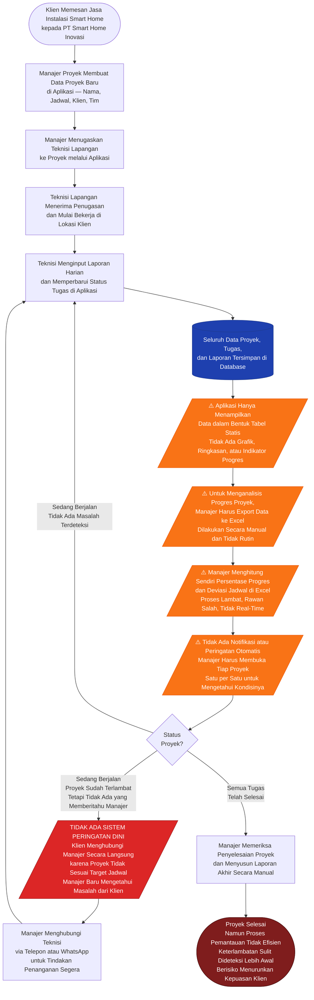

# Bagan Alur Proses Bisnis Sebelum Pengembangan Dashboard
## PT Smart Home Inovasi — Kondisi Aplikasi Tanpa Dashboard dan Otomasi

> Perusahaan sudah memiliki aplikasi untuk pencatatan proyek dan tugas.
> Namun aplikasi tersebut belum dilengkapi fitur dashboard analitik maupun otomasi pemantauan.
> Node **oranye** = keterbatasan aplikasi yang ada. Node **merah** = dampak langsung yang mendorong dibangunnya sistem baru.

---

---

## Apa yang Sudah Ada vs Apa yang Belum Ada

| Komponen | Kondisi di Aplikasi Lama | Keterangan |
|---|---|---|
| Input data proyek | Sudah ada | Manajer bisa buat dan edit proyek |
| Penugasan teknisi | Sudah ada | Teknisi bisa ditugaskan ke proyek |
| Input laporan harian | Sudah ada | Teknisi bisa update status tugas |
| Penyimpanan data | Sudah ada | Data tersimpan di database |
| **Dashboard analitik** | **Belum ada** | Tidak ada grafik, ringkasan, atau indikator |
| **Kalkulasi SPI otomatis** | **Belum ada** | Manajer hitung manual di Excel |
| **Indikator kesehatan proyek** | **Belum ada** | Tidak ada status Hijau / Kuning / Merah |
| **Sistem peringatan dini (EWS)** | **Belum ada** | Keterlambatan baru diketahui dari klien |
| **Sorting prioritas proyek** | **Belum ada** | Tidak bisa langsung tahu proyek mana yang kritis |
| **Notifikasi otomatis** | **Belum ada** | Manajer harus cek manual satu per satu |

---

## Akar Masalah

Data proyek sudah masuk ke sistem secara digital, tetapi berhenti di sana.
Tidak ada lapisan analitik yang mengolah data tersebut menjadi informasi yang actionable bagi manajer.
Akibatnya, manajer tetap harus bekerja di luar aplikasi (Excel, telepon, WhatsApp) untuk melakukan
fungsi pemantauan yang seharusnya bisa diotomasi oleh sistem.
