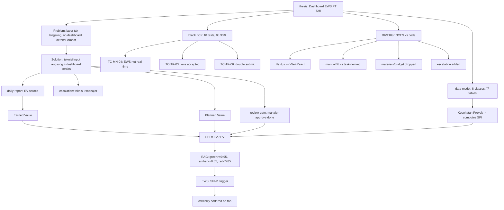
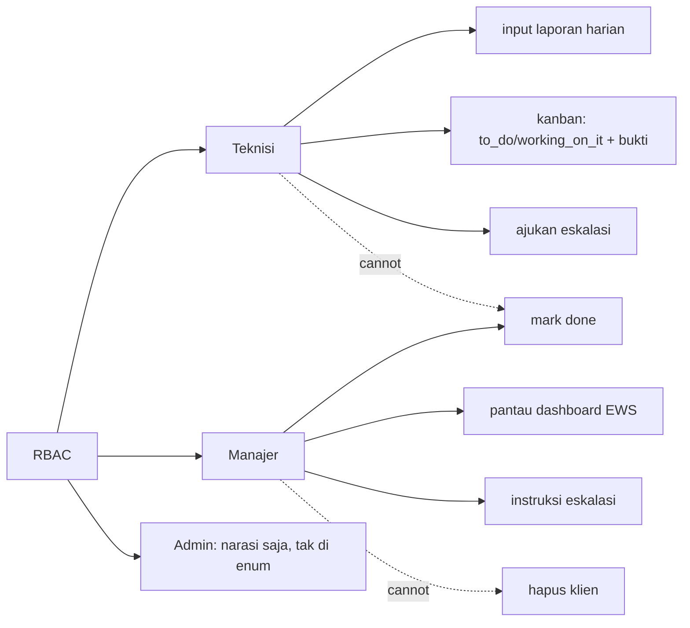

# Memory Graph - PT SHI Dashboard EWS Thesis

Knowledge graph extracted from `../Naskah TA Final 4.pdf` (114 pages). This is the **navigation hub**.

## How to use

- **`graph.json`** - machine-readable source of truth: 78 nodes + 89 edges. Query it for entities/relations. Each node has `id`, `type`, `label`, `doc` (the markdown that explains it), `props`.
- **`nodes/*.md`** - human/LLM-readable narrative, grouped by theme. Cross-linked with `[[node-id]]` wikilinks (the `id` matches `graph.json`).
- **`../bab/*.md`** - full text per chapter. **`../text/page-NNN.txt`** - raw text per page. **`../images/`** - 72 extracted images. **`../_manifest.json`** - raw inventory (every figure/table/image with page + caption).

Wikilink convention: `[[concept:spi]]` = the node with that `id` in `graph.json`; open its `doc` to read it. `[[file.md]]` = sibling doc.

## Read first

`nodes/divergences.md` - the naskah does NOT fully match the running code. That file is the most important note in this graph.

## Overview (main spine)

## Actor capability map

## Node catalog

| Type | Count | Node IDs | Documented in |
|------|-------|----------|---------------|
| thesis | 1 | thesis | nodes/00-thesis.md |
| person | 2 | person:dian, person:adityo | nodes/00-thesis.md#people |
| org | 2 | org:uty, org:pt-shi | nodes/00-thesis.md |
| chapter | 6 | bab1..bab6 | ../bab/ |
| concept | 15 | spi, ev, pv, evm, project-health, rag, ews, criticality-sort, review-gate, daily-report, escalation, rbac, kanban, computed-states, two-phase | nodes/concepts-metrics.md, nodes/concepts-workflow.md |
| actor | 3 | teknisi, manajer, admin | nodes/actors.md |
| class | 8 | user, klien, proyek, penugasan, kesehatan, tugas, bukti, eskalasi | nodes/data-model.md |
| table | 7 | tb_user, tb_klien, tb_proyek, tb_penugasan_proyek, tb_tugas, tb_bukti, tb_eskalasi | nodes/data-model.md |
| diagram | 16 | usecase, class, erd, relasi, 5x activity, 5x sequence, 2x flowchart | nodes/diagrams.md |
| test / test-fail | 1 + 3 | blackbox, tc-mn-04, tc-tk-03, tc-tk-06 | nodes/testing.md |
| reference | 7 | azkia2024, ernawan2024, gledson2024, hakim2025, auliansyah2023, iqbal2024, luthan2023 | nodes/references.md |
| divergence | 7 | spi-formula, tech-stack, daily-report, materials-budget, escalation, roles, kesehatan-table | nodes/divergences.md |

Glossary of abbreviations: `nodes/glossary.md`.

## Regenerate

`python ../extract.py` re-extracts text/images/manifest from the PDF (idempotent). The graph (`graph.json` + `nodes/`) is hand-curated on top of that - update it manually when the naskah changes.
