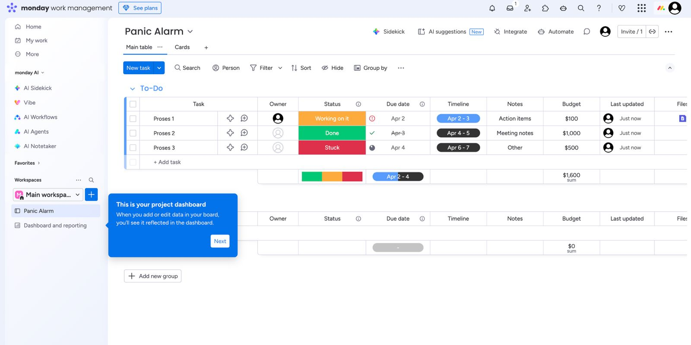
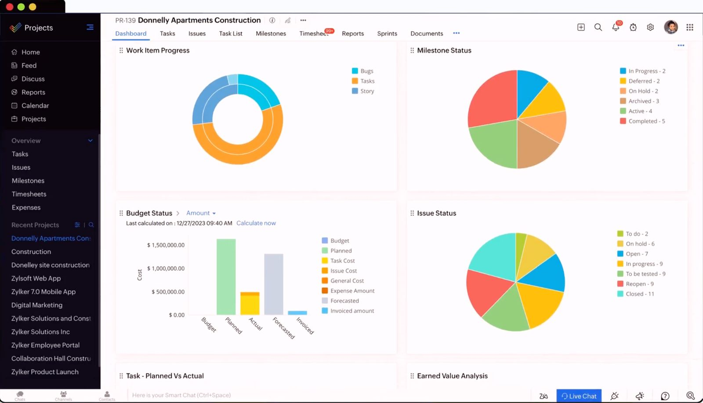
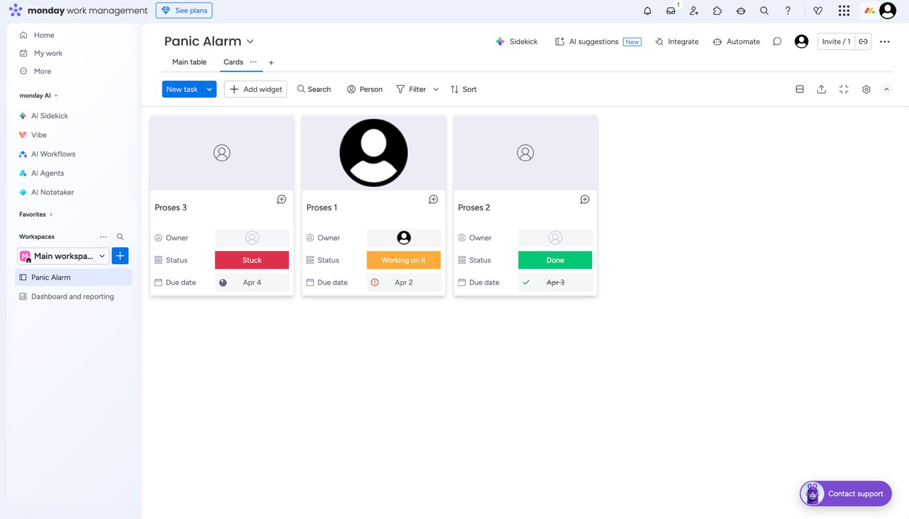
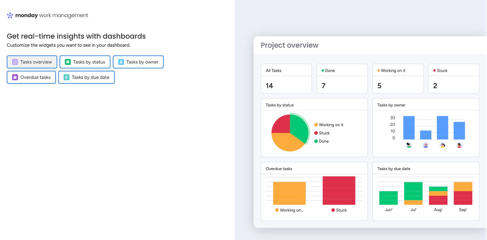

tiap "proyek" terdiri dari rincian proyek,, rincian "task",, rancangan anggaran, barang yang di indent, dan teknisi yang terlibat mengerjakan

proyek sendiri di bagi menjadi survei proyek dan pengerjaan proyek,,
harus didahului proyek

Teknisi:
-> dia login ke dashboard
-> liat di dashboard tampilannya

---> dia bisa liat proyek dan task yang di tujukan ke dia,,
--->proyek yang belum selesai padahal sudah tenggat waktunya

--> dia harus milih proyek yg mana yang mau dia kerjain
--> dia harus mengupload bukti tiap task yang sudah dia kerjakan dengan upload bukti foto, dokumen, form etc, screenshoot chat,
--> tiap task yang di selesaikan akan menambah index schedule yg mana itu bentuknya persentase penyelesaian proyek
--> tiap proyek ada target/goal/endpoint nya, dalam bentuk rancangan atau dokumen atau deskripsi

--> yang di liat teknisi bisa dalam bentuk kanban atau list down tabel

Manager:
-> dia menerima client, mengetahui detail seperti nama, alamat, nomor telepon,
-> call dengan client tuk mengetahui detail proyek
-> setelah mengetahui client dia menambahkan ke sistem, lalu membuatkan rancangan proyek
-> manager menambahkan rancangan proyek seperti rancangan anggaran, nama proyek, target tengat waktu proyek, kebutuhan alat, dan terakhir menentukan siapa teknisi lapangan yang mengerjakan proyek tersebut task per task. bisa juga dengan meng assign per proyek dipilihkan misal 3 teknisi,, nanti ada tombol otomatis utk auto assign.

-> setiap proyek di awali dengan survei, dan setelah diapprove dengan bukti dari teknisi jika sudah di survei maka bisa lanjut ke task pengerjaan proyek

-> menentukan nilai proyek dalam rupiah